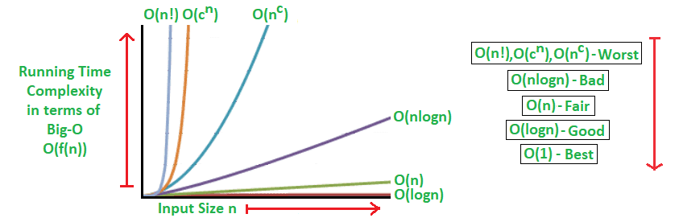

# 时间复杂度和空间复杂度分析


**时间复杂度常见的7种表达形式：**

Big O notation

O(1): Constant Complexity 常数复杂度

O(log n): Logarithmic Complexity 对数复杂度

O(n): Linear Complexity 线性时间复杂度

$O(n^2)$: N square Compleixity 平方

$O(n^3)$: N cubic Complexity 立方

$O(2^n)$：Exponential Growth 指数

$O(n!)$: Factorial 阶乘

注意： 只看最高复杂度的运算





由此可见，n在很小的时都差不多，随着n越来越大，不同时间复杂度的差距越来越大，最好的时间复杂度是线性时间复杂度O(1) 最差的是阶乘，指数等级别的时间复杂度。


时间复杂度的数学公式比较复杂，所以我们可以简化为通过读程序的方式来判断时间复杂度。

O(1): 常数操作

```java
int n = 1000;
System.out.println("Hey - your input is: " + n);
```

O(3) - 还是算作O(1), 因为都是常数值

```java
int n = 1000;
System.out.println("Hey - your input is: " + n);
System.out.println("Hmm... I'm doing more stuff with:" + n);
System.out.println("And more:" + n);
```

O(n): 时间复杂度是和n成线性关系的

```java
for (int i = 1; i <= n; i++) {
  System.out.println("Hey - I'm busy looking at:" + i);
}
```

$O(n^2)$: 嵌套的代码， N是100的话，总共执行次数就是100*100了

```java
for (int i = 1; i <= n; i++) {
  for (int j = 1; j <= n; j++) {
    System.out.println("Hey - I'm busy looking at:" + i + " and" + j);
  }
}
```

$O(log(n))$: 如果 n = 4的话，执行次数只有2次

```
for (int i = 1; i <= n; i = i * 2) {
  System.out.println("Hey - I'm busy looking at:" + i);
}
```

$O(k^n)$ ：指数级的时间复杂度； 计算时间复杂度可以利用递归的执行顺序画出树形结构，得出最后的时间复杂度上限就是叶子的个数$K^n$. 这里斐波那契数列就是$2^n$ 所以时间复杂度可以认为是$O(2^n)$

```java
int fib(int n) {
  if (n < 2) retrun n;
  return fib(n - 1) +. fib(n - 2);
}
```

面试中不要写出指数级别的代码，应该用cache来优化

关于递归时间复杂度的求解可以通过主定理公式来计算，但是也有简化的方法


**主定理公式：**


二分用常数项时间把问题拆分成$n/2$大小的问题

合并排序，用n的时间把两个拆分的$n/2$ 问题合并


**思考题**

Q1 手写二叉树遍历-前、中、后序，并分析时间复杂度？

答：$O(n)$， 这里的n代表二叉树里边的树的节点总数。通过主定理得到；或者这么说不管是前序中序后续，二叉树里边的每个节点会访问一次且仅访问一次，所以它的时间复杂度和二叉树的节点总数线性相关，因此是$O(n)$ 

Q2 图的遍历：时间复杂度是多少？ 

答：$O(n)$，这里的n的话是图里所有的节点总数。

 Q3 搜索算法：DFS、BFS的时间复杂度 答：不管是DFS(深度优先)、BFS（广度优先），时间复杂度都是$O(n)$

可以简单理解为只BFS，DFS都是只遍历所有结点一次。


**求递归的空间复杂度的方法：**

max(开辟数组的长度, 递归的深度)

通过爬楼梯这道题目的leetcode题解来详细分析时间复杂度和空间复杂度的不断优化。


注：数据结构和各种算法的复杂度可见 [Big-O-cheat-sheet]( https:///?dark-mode=true)

